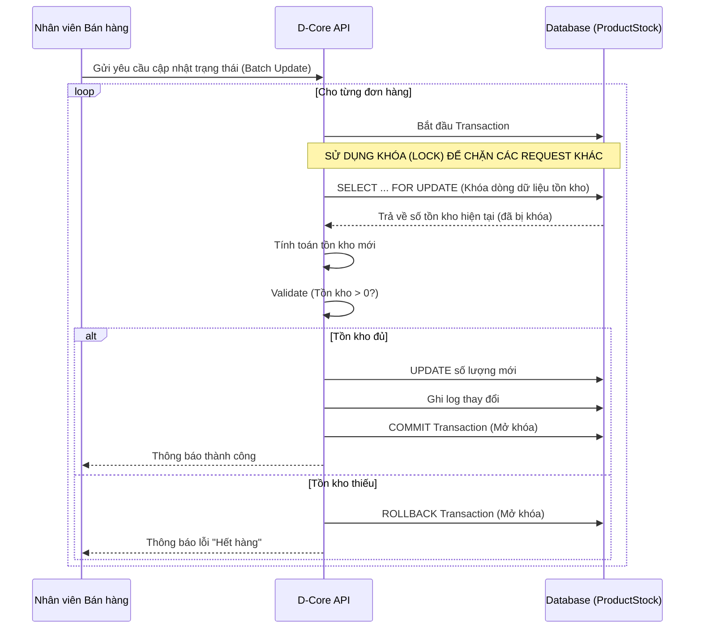
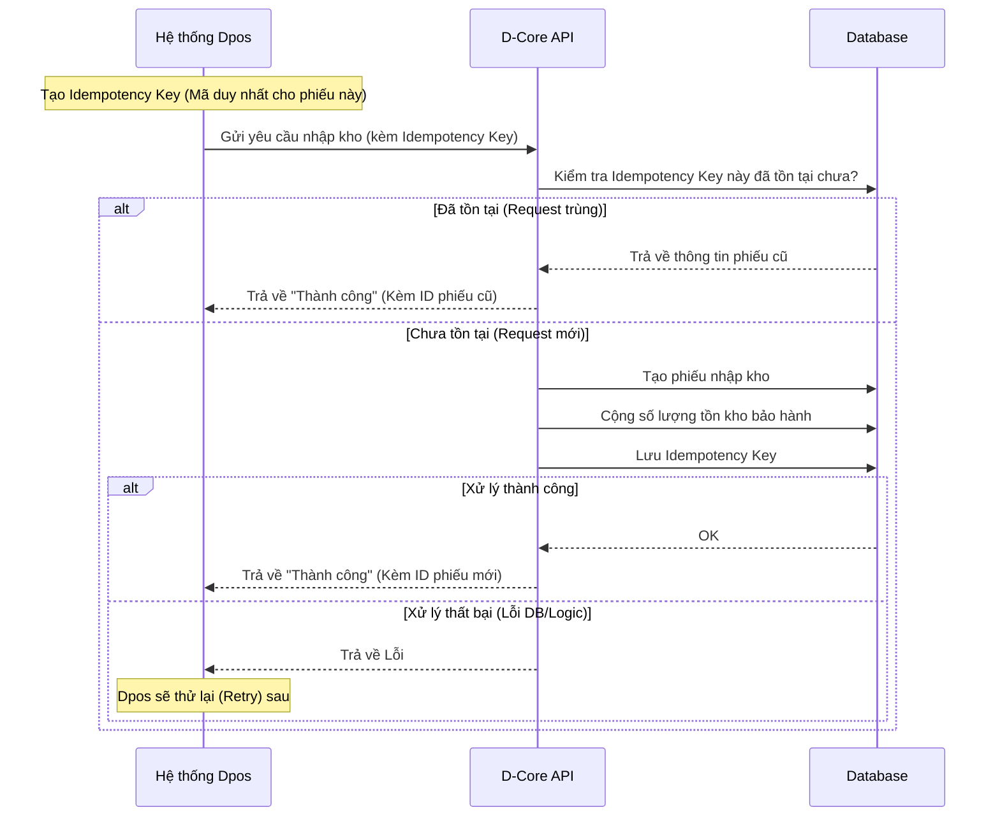
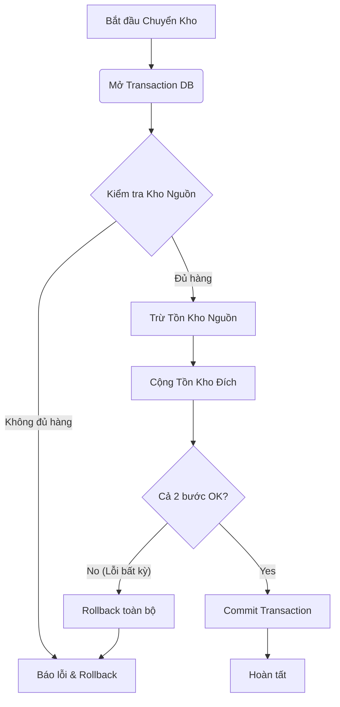

# Functional Requirements Specification (FRS)
## Giải Quyết Vấn Đề Tồn Kho Ảo - D-Core API

---

**Document Information**

| Field | Value |
|-------|-------|
| **Project Name** | Fix Phantom Stock Issues |
| **Document Version** | 1.0 |
| **Date Created** | 09/02/2026 |
| **Author** | Business Analyst Team |
| **Status** | Draft for Review |
| **Priority** | 🔴 Critical |

---

## 📑 Table of Contents

1. [Tổng Quan (Overview)](#1-tổng-quan-overview)
2. [Phạm Vi & Mục Tiêu (Scope & Goals)](#2-phạm-vi--mục-tiêu-scope--goals)
3. [Quy Trình Nghiệp Vụ (Business Workflows)](#3-quy-trình-nghiệp-vụ-business-workflows)
4. [Yêu Cầu Chức Năng Chi Tiết (Detailed Functional Requirements)](#4-yêu-cầu-chức-năng-chi-tiết-detailed-functional-requirements)
5. [Yêu Cầu Phi Chức Năng (Non-Functional Requirements)](#5-yêu-cầu-phi-chức-năng-non-functional-requirements)
6. [Tiêu Chí Chấp Nhận (Acceptance Criteria)](#6-tiêu-chí-chấp-nhận-acceptance-criteria)

---

## 1. Tổng Quan (Overview)

### 1.1 Bối Cảnh
Hệ thống D-Core API hiện đang gặp phải vấn đề nghiêm trọng về độ chính xác của số liệu tồn kho (Phantom Stock). Tồn kho ảo - tức sự sai lệch giữa số lượng tồn kho trên hệ thống và số lượng thực tế - đang gây ra các hệ quả tiêu cực:
- **Đơn hàng bị hủy:** Khách hàng đặt mua sản phẩm hiển thị "còn hàng" nhưng thực tế đã hết.
- **Thất thoát hàng hóa:** Khó kiểm soát hàng bảo hành nhập kho nhưng không được ghi nhận.
- **Sai lệch luân chuyển:** Hàng chuyển đi nhưng kho đích không nhận được trên hệ thống.

### 1.2 Vấn Đề Cốt Lõi
Qua phân tích kỹ thuật, 3 nguyên nhân chính đã được xác định:
1.  **Race Condition (Đua tranh dữ liệu):** Xảy ra khi cập nhật trạng thái đơn hàng hàng loạt. Nhiều yêu cầu cùng đọc một số lượng tồn kho cũ và ghi đè lên nhau.
2.  **Thiếu Idempotency (Tính duy nhất):** Hệ thống Dpos gửi yêu cầu nhập kho bảo hành, nếu gặp lỗi mạng và gửi lại (retry), hệ thống D-Core có thể xử lý sai hoặc không xử lý do timeout, dẫn đến mất phiếu hoặc trùng phiếu.
3.  **Giao Dịch Phân Tán (Distributed Transaction Issues):** Quy trình chuyển kho thực hiện trừ kho nguồn và cộng kho đích trong các bước rời rạc, không đảm bảo tính nguyên vẹn (atomicity).

---

## 2. Phạm Vi & Mục Tiêu (Scope & Goals)

### 2.1 Phạm Vi (In-Scope)
Tài liệu này tập trung xử lý lỗi tại các quy trình sau:
- **Quy trình Xử lý Đơn hàng:** Cụ thể là thao tác chuyển đổi trạng thái đơn hàng (Đã xác nhận -> Thành công/Đang vận chuyển).
- **Quy trình Bảo hành:** Tạo phiếu nhập kho bảo hành từ hệ thống Dpos.
- **Quy trình Chuyển kho:** Luân chuyển hàng hóa giữa các kho nội bộ.

### 2.2 Mục Tiêu
- **Triệt tiêu Race Condition:** Đảm bảo tồn kho trừ đúng số lượng ngay cả khi có hàng trăm yêu cầu cùng lúc.
- **Đảm bảo tính toàn vẹn dữ liệu:** Không bao giờ có trường hợp trừ kho nguồn mà không cộng kho đích (và ngược lại).
- **Loại bỏ trùng lặp:** Đảm bảo mỗi phiếu nhập/xuất kho chỉ được tạo duy nhất 1 lần.

---

## 3. Quy Trình Nghiệp Vụ (Business Workflows)

### 3.1 Quy Trình Xử Lý Đơn Hàng (Đã Cải Tiến)

Quy trình này mô tả cách hệ thống xử lý khi nhân viên đổi trạng thái nhiều đơn hàng cùng lúc để đảm bảo tồn kho chính xác.

### 3.2 Quy Trình Nhập Kho Bảo Hành (Từ Dpos)

Quy trình đảm bảo không bị mất phiếu hoặc trùng phiếu khi Dpos gửi yêu cầu.

### 3.3 Quy Trình Chuyển Kho (2-Phase Commit)

Quy trình đảm bảo chuyển hàng an toàn giữa 2 kho.

---

## 4. Yêu Cầu Chức Năng Chi Tiết (Detailed Functional Requirements)

### 4.1 Quản Lý Tồn Kho & Đơn Hàng (Inventory & Order)

| ID | Tên Yêu Cầu | Chi Tiết |
|----|-------------|----------|
| **FR-INV-01** | **Cơ chế khóa Pessimistic Locking** | Khi cập nhật số lượng `ProductStock`, hệ thống PHẢI sử dụng cơ chế `SELECT ... FOR UPDATE` (hoặc tương đương trong Sequelize) để ngăn chặn các request khác đọc/ghi cùng lúc vào bản ghi đó. |
| **FR-INV-02** | **Kiểm tra tồn kho âm** | Trước khi lưu vào DB, hệ thống PHẢI kiểm tra giá trị sau khi trừ. Nếu < 0, giao dịch phải bị hủy bỏ (Rollback) và trả về lỗi cụ thể cho người dùng. |
| **FR-INV-03** | **Validation tổng số lượng** | Hệ thống PHẢI đảm bảo phương trình: `quantity = inStockQuantity + deliveryQuantity + transferQuantity + holdingQuantity + warrantyQuantity` luôn đúng sau mọi thay đổi. |

### 4.2 Tích Hợp Bảo Hành (Warranty Integration)

| ID | Tên Yêu Cầu | Chi Tiết |
|----|-------------|----------|
| **FR-WAR-01** | **Hỗ trợ Idempotency Key** | API tạo phiếu nhập kho bảo hành PHẢI chấp nhận một trường `idempotencyKey` trong header hoặc body. |
| **FR-WAR-02** | **Xử lý trùng lặp** | Nếu nhận được một `idempotencyKey` đã tồn tại trong vòng 24h qua, API PHẢI trả về kết quả thành công của lần xử lý trước đó mà không thực hiện lại logic trừ/cộng kho. |
| **FR-WAR-03** | **Atomic Transaction** | Việc tạo phiếu `StockSlip` và cập nhật `ProductStock.warrantyQuantity` PHẢI nằm trong cùng một Database Transaction. Nếu một trong hai thất bại, cả hai phải được hủy bỏ. |

### 4.3 Chuyển Kho (Stock Transfer)

| ID | Tên Yêu Cầu | Chi Tiết |
|----|-------------|----------|
| **FR-TRANS-01** | **Giao dịch nguyên tử (Atomic)** | Thao tác trừ kho nguồn và cộng kho đích PHẢI được thực hiện trong cùng 1 transaction. Tuyệt đối không tách rời thành 2 API calls hoặc 2 transactions độc lập. |
| **FR-TRANS-02** | **Cập nhật trạng thái Transfer** | Khi hàng đang đi đường, số lượng `transferQuantity` phải được cập nhật tương ứng, không được làm mất dấu số lượng này. |

---

## 5. Yêu Cầu Phi Chức Năng (Non-Functional Requirements)

- **Performance:** Thời gian phản hồi cho API cập nhật trạng thái đơn hàng không vượt quá 2s cho lô 50 đơn hàng (đã tính thời gian chờ lock).
- **Consistency:** Dữ liệu tồn kho phải đạt độ chính xác 100% trong các kịch bản test đồng thời (concurrent testing).
- **Monitoring:** Hệ thống phải có cảnh báo (alert) gửi về Telegram/Slack nếu phát hiện bất kỳ giao dịch nào có dấu hiệu làm lệch tồn kho (ví dụ: tổng quantity không khớp).

---

## 6. Tiêu Chí Chấp Nhận (Acceptance Criteria)

### Kịch bản 1: Mua tranh hàng (Race Condition)
- **Cho trước:** Sản phẩm A có tồn kho = 1.
- **Hành động:** 2 nhân viên cùng lúc đổi trạng thái 2 đơn hàng (mỗi đơn mua 1 sp A) sang "Thành công".
- **Kết quả mong đợi:** 
    - 1 đơn hàng thành công -> Tồn kho về 0.
    - 1 đơn hàng báo lỗi "Hết hàng" -> Không được phép trừ xuống -1.

### Kịch bản 2: Spam nút nhập kho (Idempotency)
- **Cho trước:** Nhân viên Dpos nhập kho 1 máy bảo hành.
- **Hành động:** Do mạng lag, Dpos gửi 5 request giống hệt nhau (cùng `idempotencyKey`) liên tiếp.
- **Kết quả mong đợi:**
    - Hệ thống chỉ tạo 1 phiếu nhập kho duy nhất.
    - Tồn kho bảo hành chỉ tăng thêm 1.
    - Cả 5 request đều nhận được phản hồi "Thành công".

### Kịch bản 3: Chuyển kho lỗi
- **Cho trước:** Chuyển 10 sp từ Kho A sang Kho B.
- **Hành động:** Giả lập lỗi DB xảy ra ngay sau khi trừ kho A nhưng trước khi cộng kho B.
- **Kết quả mong đợi:**
    - Transaction Rollback.
    - Kho A vẫn giữ nguyên 10 sp (không bị mất).
    - Kho B không tăng.
    - Không có phiếu chuyển kho "ma" được tạo ra.
